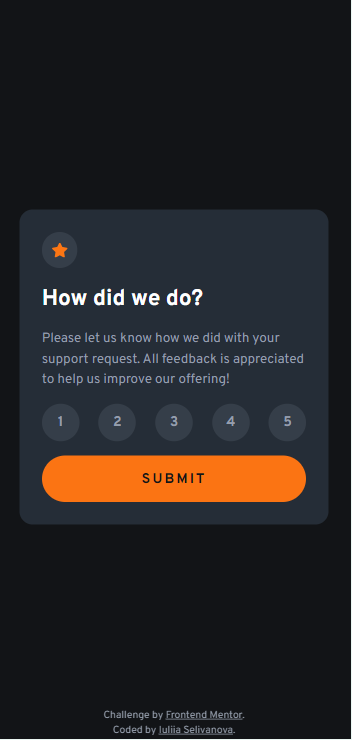

# Frontend Mentor - Interactive rating component solution

This is a solution to the [Interactive rating component challenge on Frontend Mentor](https://www.frontendmentor.io/challenges/interactive-rating-component-koxpeBUmI).

## Overview

### The challenge

Users should be able to:

- View the optimal layout for the app depending on their device's screen size
- See hover states for all interactive elements on the page
- Select and submit a number rating
- See the "Thank you" card state after submitting a rating

### Screenshot

 

### Links

- Solution URL: (https://github.com/IuliiaSelivanova/Interactive-rating-component)
- Live Site URL: [Add live site URL here](https://your-live-site-url.com)

### Built with

- Semantic HTML5 markup (BEM)
- CSS custom properties
- Flexbox
- CSS Grid
- Mobile-first workflow
- Javascript

## Author

- GitHub - [Iuliia Selivanova](https://github.com/IuliiaSelivanova)
- Frontend Mentor - [@IuliiaSelivanova](https://www.frontendmentor.io/profile/IuliiaSelivanova)
